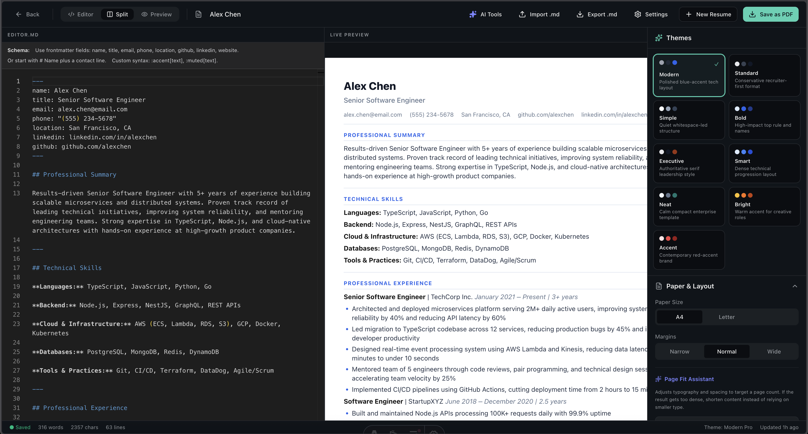

# MDResume

[](https://github.com/sumitgohil/mdresume/actions/workflows/codeql.yml)


MDResume is an open-source Markdown resume builder for people who want a clean, portable way to write resumes, preview
them, and export polished PDFs. The public website is built with Astro for fast static pages, while the interactive
resume editor runs as a React island on `/editor`.

- Website: https://mdresume.app/
- Repository: https://github.com/sumitgohil/mdresume

The project is designed around a simple idea: the resume source should stay readable and reusable. Users write structured
Markdown, choose an ATS-friendly template, preview changes live, and optionally use BYOK AI tools for resume review,
keyword checks, bullet rewrites, and cover-letter drafts.



## What You Can Do

- Write resume content in Markdown.
- Preview the resume live while editing.
- Switch between professional resume templates and themes.
- Export a polished PDF from the browser.
- Browse role-specific resume templates and examples.
- Read long-form resume writing guides.
- Use optional bring-your-own-key AI resume review tools.
- Keep the core resume workflow usable without signup or a hosted backend.

## Tech Stack

- Astro static output for public pages.
- React islands for the interactive editor and AI panel.
- Markdown content collections for blog posts.
- Typed resume data for templates and examples.
- Zustand for editor state.
- React Markdown and custom resume directives for preview rendering.
- Vitest for helper, schema, content, and SEO tests.
- Cloudflare Pages-ready static deployment.

## Project Structure

```text
MdResumeAstro/
  public/
    editor.png              # README and site screenshot asset
    llms.txt                # LLM-facing product reference
    _headers                # Cloudflare Pages headers
  src/
    components/             # Astro and React UI components
    content/blog/           # Markdown blog posts
    data/resume.ts          # Resume templates and examples
    layouts/BaseLayout.astro
    lib/                    # SEO, parser, schema, AI, and editor helpers
    pages/                  # Astro routes
    store/resumeStore.ts    # Editor state
  tests/                    # Vitest coverage
  astro.config.mjs
  package.json
```

## Local Development

Use Node.js `22.12.0` or newer. Run commands from the `MdResumeAstro` directory.

```bash
pnpm install
pnpm dev
```

The development server prints the local URL in the terminal. The main routes are:

- `/` - product home page
- `/templates` - ATS-friendly resume template gallery
- `/examples` - role-specific resume examples
- `/ai-resume` - BYOK AI resume workflow page
- `/blog` - resume writing guides
- `/editor` - interactive Markdown resume editor
- `/sitemap.xml`, `/robots.txt`, `/llms.txt` - crawler and AI discovery files

## Commands

| Command | Action |
| :-- | :-- |
| `pnpm install` | Install dependencies |
| `pnpm dev` | Start the local Astro dev server |
| `pnpm test` | Run Vitest tests |
| `pnpm test:watch` | Run Vitest in watch mode |
| `pnpm build` | Build the static site to `dist/` |
| `pnpm preview` | Preview the production build locally |
| `pnpm astro` | Run Astro CLI commands |

## Writing Blog Posts

Blog posts live in `src/content/blog` and are loaded through Astro content collections. Each post is a Markdown file with
frontmatter that matches `src/content.config.ts`.

```md
---
title: "Resume Bullet Points for Software Engineers"
description: "A practical guide to writing software engineer resume bullet points with credible impact."
publishDate: 2026-06-05
tags: ["Resume Bullets", "Software Engineering", "Writing"]
---

Write the article body in Markdown.
```

Guidelines for new posts:

- Use a clear, search-friendly title.
- Keep descriptions specific and under normal meta-description length.
- Write useful content first; avoid thin keyword repetition.
- Use descriptive headings so readers can scan the article.
- Include practical examples, checklists, and workflows where helpful.
- Link naturally to `/editor`, `/templates`, `/examples`, and `/ai-resume` when the article supports those workflows.
- Run `pnpm build` after adding or removing posts so Astro validates the collection and static routes.

## Updating Resume Templates And Examples

Resume templates and example resumes are defined in `src/data/resume.ts`. When editing them:

- Keep examples realistic and role-specific.
- Prefer measurable, evidence-backed bullets.
- Make sure Markdown remains parseable by the resume schema.
- Run `pnpm test` after changes; the test suite checks resume data, parsing, schemas, themes, and markdown helpers.

## SEO And Discovery

SEO behavior is centralized in `src/lib/seo.ts` and `src/layouts/BaseLayout.astro`.

Important files:

- `src/pages/sitemap.xml.ts` builds the sitemap from static routes and blog posts.
- `src/pages/robots.txt.ts` defines crawler policy.
- `public/llms.txt` explains MDResume for AI crawlers and assistants.
- Blog pages emit article metadata and BlogPosting JSON-LD.
- Public pages use canonical URLs, Open Graph, Twitter metadata, and generated OG image paths.

When adding new public pages, make sure the page has a unique title, description, canonical pathname, and useful internal
links.

## Testing

Run the full test suite before submitting changes:

```bash
pnpm test
```

The tests cover:

- Resume schema and parser behavior.
- Template and example data quality.
- Markdown import and export helpers.
- AI evaluation prompt contracts.
- SEO helper output and schema generation.
- Static crawler files and deployment headers.

For user-facing or routing changes, also run:

```bash
pnpm build
```

The build confirms Astro content collections, static routes, generated pages, and deployment output.

## Contributing

Contributions are welcome when they make the resume builder clearer, more useful, or easier to maintain.

Good contribution areas:

- Improving resume templates or examples.
- Adding high-quality resume writing guidance.
- Tightening editor UX and export behavior.
- Improving accessibility and responsive layout.
- Expanding tests around resume parsing, schema validation, and SEO output.
- Fixing bugs in Markdown import/export, preview rendering, or AI review flows.

Before opening a pull request:

- Keep changes focused.
- Follow existing Astro, React, and TypeScript patterns.
- Avoid unrelated formatting churn.
- Add or update tests when behavior changes.
- Run `pnpm test` and `pnpm build`.
- Explain what changed and why.

## Deployment

The site is ready for Cloudflare Pages static deployment.

Recommended Cloudflare Pages settings:

- Framework preset: `Astro`
- Build command: `pnpm build`
- Build output directory: `dist`
- Node version: `22.12.0` or newer

The `public/_headers` file adds security headers and long-lived caching for Astro assets.
